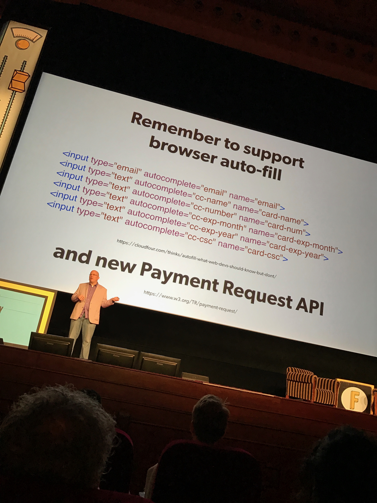
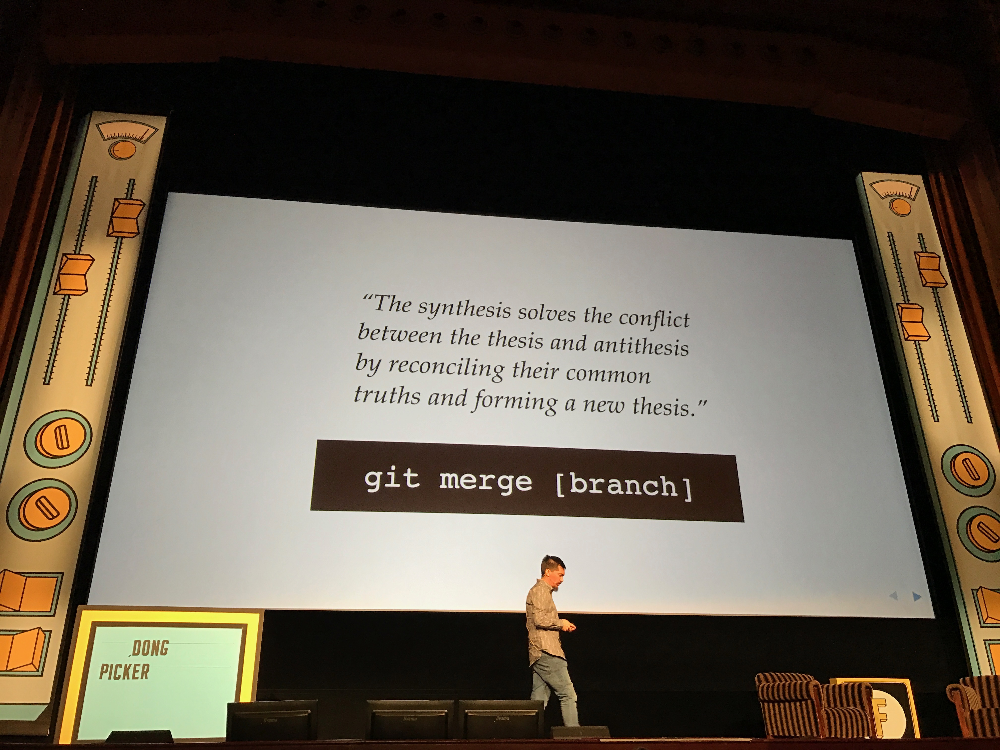
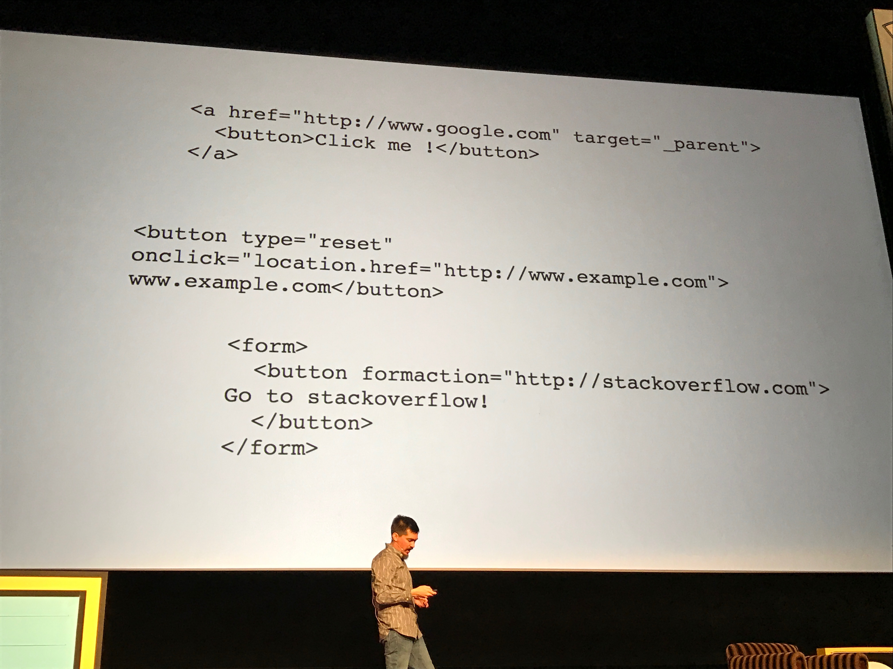

#Fronteers16 day two 7 October 2016

## Adapting to Input - [Jason Grigsby](https://twitter.com/grigs)

It's not just keyboard and mouse anymore
Touch, Multi-touch, Camera, GPS, Bluetooth (LE), compass, accelerometer, etc..
Also think about gestures & voice control.
 
How are we going to use gestures or predictive touch?

### Why should we detect touch if we don't detect mouses and keyboards?
- Mouses/keyboards can be added/removed easily.
- You can use touch the first moment and a mouse the next.

Fitts's Law
The time to aquire a target is a function of the distance to and size of the target.

Design for interaction, not input.
You're designing for user need, not a specific form factor or input.

Using a remote can be the same as using arrow keys. (you can't detect a remote).

### Abstract baseline input
Like mobile/tablet/desktop (small/medium/large)
Focus on point/select instead of tap/click

jquery pointer events polyfill ([PEP](https://github.com/jquey/pep))

Safari can fill CreditCard info from the camera.
Or just let the prefill in the browser handle it.

### Add apple pencil to the devicelab
"No device testlab inhouse, just go to the Apple store" 

[Slides](https://speakerdeck.com/grigs/adapting-to-input)
[Notes from Bram Willemse](https://workflowy.com/s/QRnBToXi7o)

## Cheat Sheet to a Lean Website - [Barbara Bermes](https://twitter.com/bbinto)
People don't like to wait.
Abandoning websites because of slow loading is high.
Especially after like 10 seconds "Forget it I'll leave"

### Treat speed as a feature
This should not be a "Nice to have" but a "Must have"
Optimize from a user's prerspective, look at the target group.

What about energy saving?

CRP (Critical Rendering Path) 
- Clean HTML √
- Cleanup DOM bij removing unused elements
- encode/compress images √
- avoid custom webfonts
- Use Gzip
- Reduse HTTP requests
- Image sprites _really? it isn't 2010 anymore_ Think about the mobile web & retina, maybe svg sprites is an alternative. 
- Use CDN's
- Offline storage
- Prevent redirects (DNS lookup)

What we're already doing
- Async/defer js loading
- scripts at bottom of the page to prevent render blocking
- Concatinate JS

### monitorring loadtime is important
Like when ads/tracking is added and loadtime shoots through the roof.

## Building Responsive CSS Components | [Zell Liew](https://twitter.com/zellwk)
Make components scalable, but how?

Main typo in REM/VW and the rest in EM. _No need for our baseline?, at least not for font-size. We still need margins to be relative to that._

Limit the number of font-sizes
Repeat the baseline, just like we already do.
- Lineheight for e.g. 24px
- Heading = 48px
- Extra spacing is + 24px or 1/2 or 2x that

Size in EM if the property is relative to font-size.

Everything else scale in REM

Extract the repeating styles to mixin's if needed.
- Determine component area maps.
- Determine breakpoints and changes in styles
- Determine units for CSS properties
- Handle complex variations with mixins (or element queries in the future)
- But especially: Don't over engineer!

### Other notes
[Bram Willemse](https://workflowy.com/s/Ji590S8RDz)

[Slides](https://github.com/zellwk/responsive-css-components-slides)

## CSP STS PKP SRI ETC OMG WTF BBQ (Modern websecurity standards) | [Scott Helme](https://twitter.com/Scott_Helme)
HTTP/2 Security features: only over https
- Geolocation 
- getUserMedia
- AppCache
- Brotli Compression (better then Gzip)
- SEO Boost 

[Slides](https://scotthelme.co.uk/static/talks/CSP%20STS%20PKP%20SRI%20ETC%20OMG%20WTF%20BBQ.pdf)

## 	Functional Animation | [Sarah Drasner](https://twitter.com/sarah_edo)

Invisible VS Immersive animation
### Invisible animation
Connecting states with smoothstate.js?
Morphing state x to state y to state z with svg animations.

Animate from modal anchor to modal window.
Keep de user busy, like an loading indicator. With a custom loader waiting time is even longer.

Opacity en Transforms trigger the least amount of repaint.

### Immersive

DOM/VirtualDOM
Pros
- Great for UI/UX animation
- Great for SVG (resolution independent) 
- Easier to debug
Cons
- tanks with a lot of objcts
- Care about the way you animate

CANVAS
Pros
- Dance, pixels dance
- great for impressive 3D
- Movement of tons of objects
Cons
- Harder to mak accessible
- not resolution independent _out of the box_
_ breaks to nothing

### SVG
- Crisp on any display
- Less HTTP requests
- Easily scalable
- Small file size (performance)
- easy to animate
- easy to make accessible

[Slides](http://slides.com/sdrasner/functional-fronteers#/)

## World-Wide Web, not Wealthy Western Web | [Bruce Lawson](https://twitter.com/brucel)
PWA - "Just a website", way smaller than an native app.

Opera mini servers compresses up to 90% of the webpage and sends it in a single binary blob to the end-user.
It allows only 5s of JS runtime.

[Slides](https://speakerdeck.com/brucel/parisweb-paris-30-september-2016)

## Technologic (Human Afterall): Accessibility Mix | [Léonie Watson](https://twitter.com/leoniewatson)
Keyboard focus-able default
- Link
- Button
- Input

Expected interactions, link activated bij click/enter
Etc for buttons and inputs.

Screenreaders use the accessibility tree.
Assistive technologies listen for changes in the accessibility tree

There are about 30 Aria roles available
Name and description:
- aria-label
- aria-describedby 

Aria has 9 states including
- checked
- pressed
- hidden
- invalid
- current

Add focus with a tabindex
tabindex 0 is the tab location on the dom-tree.

You can use [Tenon API](https://tenon.io/) with the build tools.
Tenon uses a headless browser instead of just the source of HTML

_Accessibility doesn't have to be perfect, just a little bit better than yesterday_

[Slides](http://ljwatson.github.io/decks/2016/fronteers/index.html#)

## Joining Up the Dots - [Heydon Pickering](https://twitter.com/heydonworks) 
"System thinking discourages salad punching"

The reason why people use JavaScript for basic HTML stuff.
Why?
11% of Americans thing HTML is a sexually transmitted disease.

abilities !== interests

### The problem is communication not technology 

## Other notes
[Pim Derks](https://gist.github.com/PimDerks/fc2b3c30e8b7a985a496512eda705079)
[Ian van der Wiel](https://github.com/iainvdw/fronteers-2016-notes)