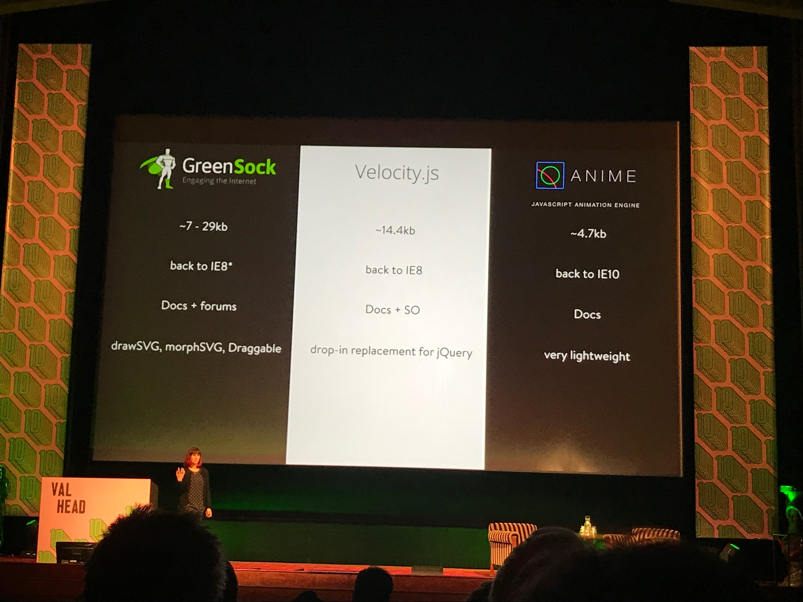

#Fronteers17 day two 6 October 2017

## The Landscape of Front-End Testing - [Alicia Sedlock](https://twitter.com/Aliciability)

Areas of testing Front-End
- Unit
- Integration
- Acceptance
- Visual Regression
- Performance
- Accessibility

### Unit tests
Ensures tat a small section of code works.
- Describe the group of tests
- Then the test, what should it do
- Expect a specific result
- You can use hooks to do initial stuff

Jasmini, Mocha, Chai, webdrive.io QUnit, Unit.js

### Integration tests
Takes single input and checks multiple outcomes, or the other way around.
Checks overall, make sure nothing breaks when a component is used elsewhere.

### Acceptance tests
Make sure we accomplish mayor tasks `e.g. signup`

##### Tools:
- Jasmine-integration
- Karma
- Selenium
- Nightwatch

### Visual Regression
Compares visually with screenshots.
There's no good workflow yet, it compares visually but you have to check manually which changes are correct or not.

#### Tools:
- PhantomCSS/PhantomFlow
- [Percy](percy.io) is a differ tool
- BackstopJS
- Wraith
- Webdriver.io

### Accessibility tests
Basic accessibility testing.
- a11y
- pa11y
- Chrome accessibility audit

### Performance tests
Check how fast things are rendered, how many time is spend on images.
**Tool:** perfbudget, gulp size, perf.js

### Mokneytesting! :monkey:
Test under stressful & chaotic conditions

**Tools:** Gremlins.js
Create a horde of gremlins

### Linting
Linting is awesome! :cool::sunglasses:

### Summary
It's to easy to turn linting/testing off

_Time-commitment is hard when it comes to testing._
- When doing code reviews require tests
- Make it an requirement
- Every change on an existing solution should get an test, especially when fixing a bug

> "javascript in cars makes me nervous"
– **Alicia Sedlock**

## A Ghost Story of CSS - [Stephen Hay](https://twitter.com/stephenhay)

## Possibilities of WebVR and its role in the future - Ruben van der Leun
[VR in presentation](http://trlvr.nl/fronteers)

Easily add 3D with Three.js, there's an impressive amount of plugins.

AFRAME HTML & JS to create VR/3D. Crossplatform
There's also a visual inspector `CTRl+ALT+I`

AR.js, marker based has support for Google Tango, ARkit and ARCore and Aframe.

[Ralitylab](http://realitylab.nl)

## Webassembly 101 – [Ash Kyd](https://twitter.com/ashkyd)

## Choose Your Animation Adventure - [Val Head](https://twitter.com/vlh)

### CSS
- well defined
- loading animations, loopings
- animations on `:hover`, `:focus`, `:blur`

#### Pro's:
- no external libraries needed
- potential performance without much effort
- keyframes are reusable
- Can adust properties in media queries for responsive animations when needed
- No big libraries or impact on loading/page-size

#### Cons
- Limited events
- Should be defined ahead of time
- Can't separate transform properties _yet_

##### CSS & JS
Let them work together to trigger events.
JS handles the logic and it does well.

#### You might want to change to JS when...
- chaining more then 3 animations in a sequence
- The animation needs to change dynamically at runtime, CSS needs it defined before
- You need to animate transform properties separately
- Complex easing structures are required (springs, bounce etc...)

### JS

#### Great at:
- complex animated interactions
- Narrative or immersive animations
- Dynamic state transitions ( stripe logo & resource page)

Use when you need to animate multiple items based on one events

Framerate tracking performant `requestAnimationFrame`

#### JS animation libraries
They take away the work for easing functions in JS, makes it a lot simpler.

- Greensock
- Velocity.js _maintained again_
- Anime JS

They all have in common: similar syntax

### SVG
- animated illustrations
- animated icons
-
- scalability

**Animated logo's: SVG!**

SVG is great at shape morphing.

CSS can ben used for animating SVG

#### SVG Shines at:
- Shape morphing
- motion along path

#### Biggest pro:
- repsonsive by nature
- tiny filesizes

[designinginterfaceanimation](designinginterfaceanimation.com)
[uianimationnewsletter](uianimationnewsletter.com)

## Emoji, Web Components, and Art - [Monica Dinculescu](http://twitter.com/notwaldorf) | [bot](http://twitter.com/to_emoji)

### Funstuf
- emoji.octopus.holdings
- make8bitart.com
- megamoji.muan.co
- https://meowni.ca/emojillate/

## I'm offline, cool! What now? - Ola Gasidlo

## THE END - Jason Scott
